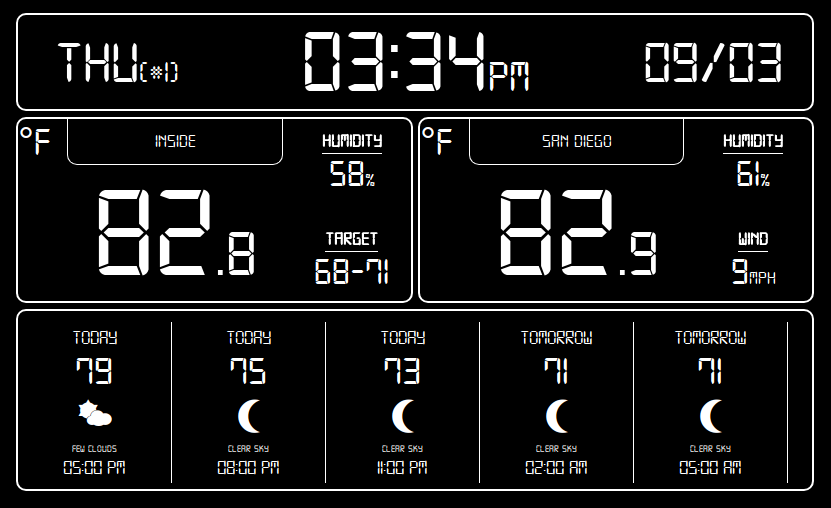

# WeatherDash

**Smart weather dashboard.**

**Integrates with OpenWeatherMaps and Ecobee.**

**Designed to run on RaspberryPi.**

**Written with Node and Angular.**
 
 
## Server
The WeatherDash server is a Node application.

This server is designed to:

- Access the configured APIs (currently OpenWeatherMaps and Ecobee)
- Process and cache API reponses
- Host WeatherDash API endpoints to provide this data to the client application.
### Setting Up the Server
	cd server
#### Install Dependencies
	npm install
#### Confgure
##### OpenWeatherMaps
- Go to: https://openweathermap.org/appid
- Login or Create an account
- Generate an API key
- Under the **keys** directory, populate your API key in a file called **owm.key**
- In **config.js**, set the values of **DEFAULT_UNIT** and **DEFAULT_ZIP_CODE** to your preference. 
( *Note*: these settings can be overridden via the WeatherDash API by the client application config and UI)
##### Ecobee
- Go to: https://www.ecobee.com/developers/
- Login or Create Account
- Enable developer dashboard
- Generate an API key (you'll only need read permissions)
- Under the **keys** directory, populate your API key in a file called **ecobee.key**
### Starting the Server
	npm start
**You'll need to run the server manually the first time.**
The first time you run the server, you'll be presented with instructions for pairing the application with your Ecobee account, using a pin code.
After that succeeds, no further manual interaction with the server should be necessary.
From that point, the server will access the OpenWeatherMaps and Ecobee APIs, negotiate token refreshes, and host an API endpoint for the client application.
The WeatherDash API endpoint will be hosted at localhost:8000

## Client
The WeatherDash client is an Angular application.

The client is designed to:

- Access API data from server application
- Display time and date info
- Display Ecobee indoor climate info
- Display OpenWeatherMaps city climate info
- Display OpenWeatherMaps city forecast info
### Setting Up the Client
	cd client
#### Install Dependencies
	npm install
#### Confgure
 In **src/app/weatherdash/weatherdash.config.ts**, set the values of **defaultZip** and **defaultUnit** to your preference. 
 ( *Note*: these settings can be overridden by the UI and will persist via localstorage)
### Starting the Client
	ng serve
**The WeatherDash UI will be hosted at localhost:4200**

## Using the App
In your browser, navigate to: **localhost:4200**

There's just a few interactions possible with the app:

- If multiple thermostats are connected to your Ecobee account, you will be prompted to select the one you wish to display.  If you change your mind, simply refresh the page and change your selection.
- Clicking the City Name will allow you to change the zip code.  Your choice will be saved across sessions via localStorage.
- Clicking the Unit Symbol (in the upperleft corner of either Indoor or Local weather) will allow you switch between Imperial and Metric units.  Your choice will be saved across sessions via localStorage.
- The Forecast can be dragged horizontally to view up to 5 days of weather outlook.

## Setting Up On Raspberry Pi
You will need a Raspberry Pi board with some form of display output.  This could be HDMI to a monitor, a MIPI display, a VNC/RDP session, etc.  You'll also need a network connection, via onboard WiFi, WiFi dongle, or ethernet cable.  And of course, some method for input will be necessary, be it a USB keyboard or ssh.

Personally, I'll be using a Raspberry Pi 2 Model B, with the Official Raspberry Pi Touch Display.  Both will be housed in a SmartiPi Touch case.  Since the Pi 2B doesn't have onboard WiFi, I'll be using a cheap (RTL8188CUS) WiFi dongle.  And lastly, a USB keyboard during initial configuration.

Setup your Pi with Raspbian according to the official documentation.  Follow through the steps to get a network connection and configure your display if necessary.

### Disable Screensaver (optional)
You'll likely want to disable the screensaver so that the WeatherDash app is always on display:
	
	sudo apt-get install xscreensaver
	xscreensaver

Click **Settings**, and set **Mode** to **Disable Screen Saver**

### Hide Cursor on Idle (optional)
Install unclutter:

	sudo apt-get install unclutter

To hide cursor after being idle for 3 seconds, add the following line to **/home/pi/.config/lxsession/LXDE-pi/autostart**:

	@unclutter -idle 3

### Dim Backlight (optional)
If you are using the offical Raspberry Pi 7" Touch Display, there's a virtual filesystem which can be used to interact with the display:

	sudo sh -c 'echo "128" > /sys/class/backlight/rpi_backlight/brightness'
	
The number you echo must be between 0 and 255.  Find a number that works for you.  You want to set it such that the display is bright enough to cut through most glare in a well-lit room while also dim enough to not be harsh in a darkened room.  Lower brightness means lower power consumption. I eventually settled on 20.

### Overclock (optional)
Downloading NPM packages and building Angular applications can be a bit slow on the Raspberry Pi.  As an optional step, you may wish to overclock your Pi.  This can be done via the Overclock menu in:

	sudo raspi-config
	
(*Note*: You'll want to reboot if you changed any Overclock settings)
	
### Install Node and NPM
Then, you'll want to install a modern version of Node and NPM:

	curl -sL https://deb.nodesource.com/setup_8.x | sudo -E bash -
	sudo apt-get install -y nodejs
	

With NPM, install the Angular CLI and HTTP Server:

	npm install -g @angular/cli
	npm install -g angular-http-server
	
### Install WeatherDash
If you haven't done so already, clone this repo:

	git clone https://github.com/Mrjohns42/WeatherDash.git /home/pi/WeatherDash
	
Follow the sections above to setup and start the Server and Client, and then open the WeatherDash app in a browser to verify your setup was done correctly. 

To automatically run the Client and Server and open the WeatherDash app in fullscreen mode, there is a helpful bash script in the root of the repo.

	startup.sh
	
(*Note*: to exit Chromium's Fullscreen Mode, use F11)
	
To run this script automatically at Login, add the following line to **/home/pi/.config/lxsession/LXDE-pi/autostart**:

	@lxterminal -e /home/pi/WeatherDash/startup.sh	
	
Then reboot, and WeatherDash should automatically build and launch.
	
#### ENJOY!
	

	
	
	
	
